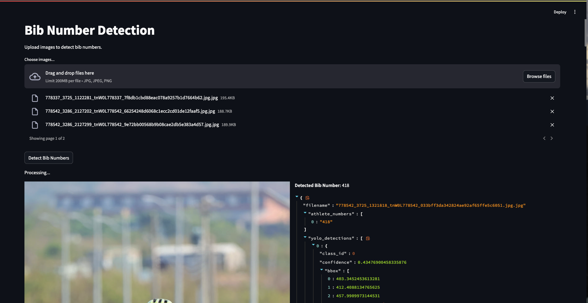

# athlete-number
 

This API extracts athlete bib numbers from images using YOLO-based detection and OCR (Tesseract). It supports batch processing for efficient number extraction.


## Setup & Installation
- Prerequisites
   - Ubuntu/Linux
   - Python 3.10+
   - Poetry (for dependency management)
   - Tesseract OCR (Required for text extraction)
       ```bash
       sudo apt update && sudo apt install -y tesseract-ocr libtesseract-dev
       ```

- Install Dependencies with Poetry

    ```bash
    make install
    ```
or manually:
    ```bash
    poetry install
    ```

## Running the API
- Start Development Server
    ```bash
    make start-service
    ```
or manually
    ```
    poetry run uvicorn athlete_number.main:app --host 0.0.0.0 --port 5566 --reload
    ```

- Access the API:
   - Swagger UI: http://0.0.0.0:5566/docs
   - Redoc UI: http://0.0.0.0:5566/redoc


## API Endpoints

| Method | Endpoint                | Description |
|--------|-------------------------|-------------|
| **POST** | `/extract/bib-number`  | Detects and extracts athlete bib numbers using YOLO and OCR. |

---

### **Detect Athlete Bib Numbers**
#### **Endpoint**
```
POST /extract/bib-number
```
#### **Description**
Uses **YOLO and OCR** to detect and extract athlete bib numbers from images.

#### **Request**
- **Content-Type**: `multipart/form-data`
- **Files**: One or more image files (`.jpg`, `.png`)

#### **Response**
- Detected bib numbers, YOLO bounding boxes, OCR-extracted text, confidence scores, and processing time.

#### **Example Request (cURL)**
```bash
curl -X 'POST' 'http://127.0.0.1:5566/extract/bib-number' \
  -H 'accept: application/json' \
  -H 'Content-Type: multipart/form-data' \
  -F 'files=@race1.jpg' \
  -F 'files=@race2.jpg'
```

#### **Example Response**
```json
[
    {
        "filename": "race1.jpg",
        "athlete_numbers": ["12345"],
        "yolo_detections": ["bbox_data"],
        "ocr_results": ["12345"],
        "processing_time": 0.85,
        "confidence": 0.98,
        "model_versions": {
            "detection": "YOLOv11-Bib",
            "ocr": "tesseract-v5.3.1"
        }
    },
    {
        "filename": "race2.jpg",
        "athlete_numbers": [],
        "yolo_detections": [],
        "ocr_results": [],
        "processing_time": 0.0,
        "confidence": 0.0,
        "model_versions": {
            "detection": "N/A",
            "ocr": "tesseract-v5.3.1"
        }
    }
]
```

## Athlete Number Detection Demo
> This demo page provides an intuitive way to test the Athlete Number Detection API using a simple web interface built with Streamlit.

### Features
- Upload one or multiple images.
- Detect athlete bib numbers using YOLO-based detection and OCR.

### Running the Demo
```bash
streamlit run frontend/demo.py
```

