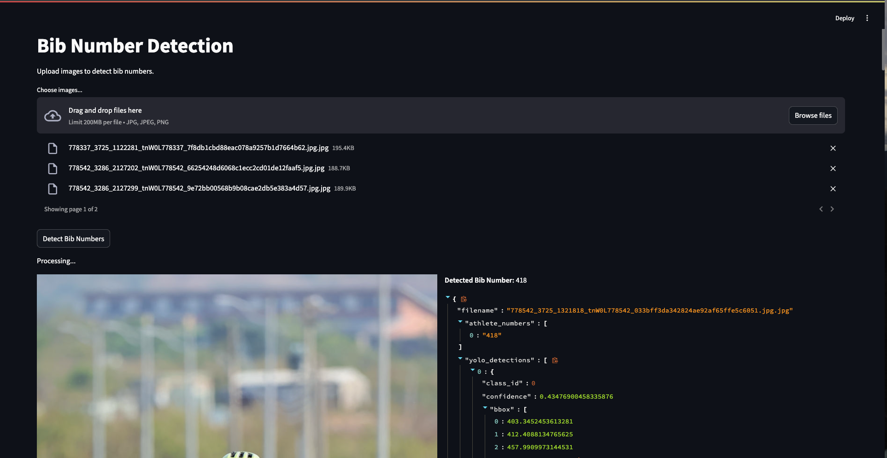

# Athlete-Number Frontend Detection

## **Prerequisites**
- **Python 3.10+**
- **Docker** (for containerized deployment)
- **Poetry** (for local development)

---
## Running the Demo**
### I. With Docker
```bash
docker build -t athlete-frontend -f frontend/Dockerfile .
docker run -p 8501:8501 athlete-frontend
```
Access the demo at http://localhost:8501.

### II. Locally (Development Mode)
```bash
streamlit run frontend/demo.py
```


